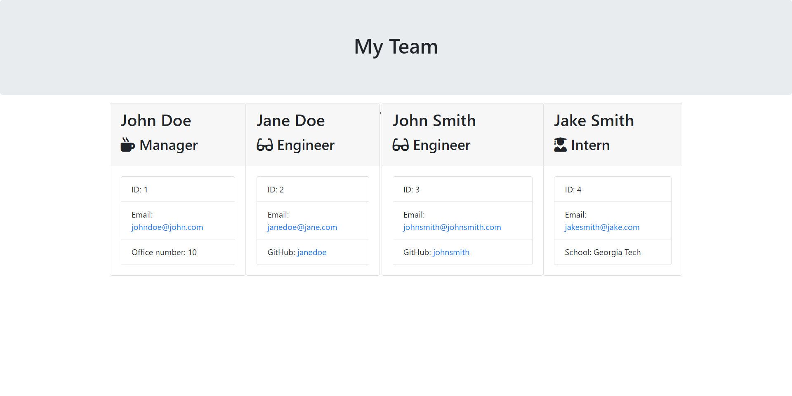

# TEAM-PROFILE-GENERATOR-OOP

  

  ## Table of Contents
  * [Description](#description)
  * [Installation](#installation)
  * [Usage](#usage)
  * [Contributors](#contribution)
  * [Tests](#test)
  * [License](#license)
  * [Questions](#questions)
  
  ## Description 
  This purpose of this program is to generate profiles for the different members of your team by answering the questions that are prompted in the CLI through node.js. This program will reduce the time it takes to create profiles for the members of your organization.
  
  ## Installation 
  Must have a code editor. Need to have a basic foundation of HTML, CSS, bootstrap, JavaScript, node.js, OOP, and unit testing. Must have node.js, inquirer module, and jest module installed.

  ## Usage 
  To generate member profiles within minutes versus creating them from scratch.

  ## Contributors
  This project is open to contributions.

  ## Tests
  Follow the video added to the README.md to see how to use this program.

  ## License 
  The application is covered under the ISC license.

  ## Image
  
  
  ## Live Demo
  

https://user-images.githubusercontent.com/84283930/168775799-153dba4e-61cc-49da-a118-c94c66513324.mp4

  ## Questions
  You can search for my repo on GitHub by entering Bungycode and you can view my projects at https://github.com/Bungycode. If you have any questions, please contact me at thedevandrew@gmail.com

